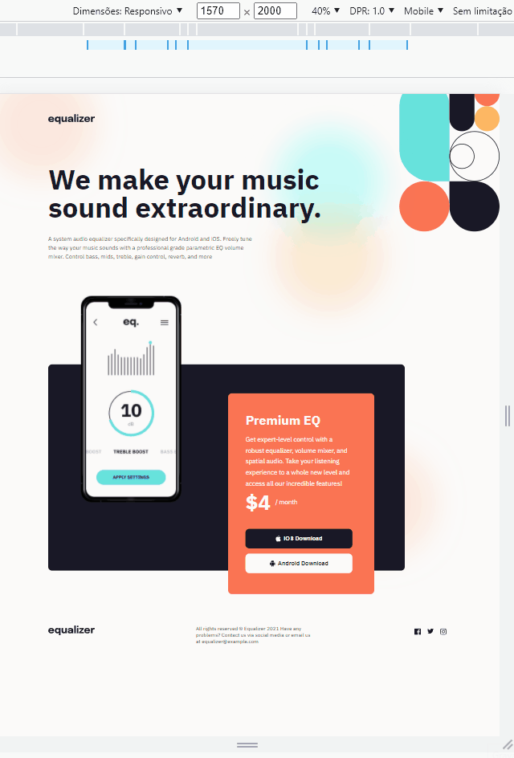

<h1 align="center" class="line-1 anim-typewriter">Equalizer landing page</h1>




<div align="center"  class="links">
    <a href="#the_challenge">The challenge</a> |
     <a href="#links">Links</a> |
      <a href="#built_with">Built with</a> |
       <a href="#what_i_learned">What I learned</a> |
       <a href="#resources">Resources</a> |
       <a href="#author">Author</a> 
</div>

<h2 id="the_challenge"> 🌋 The challenge</h2>

Your challenge is to build out this landing page and get it looking as close to the design as possible.<br>
Your users should be able to:

- View the optimal layout depending on their device's screen size
- See hover states for interactive elements


<h2 id="links">🔗 Links</h2>

- Solution URL: []()
- Live Site URL: [https://equalizer-landing-page.vercel.app/](https://equalizer-landing-page.vercel.app/)


<h2 id="built_with">👷‍♂️ Built with</h2>


-   JavaScript
-   Sass
-   HTML
  -   React JS
  -   Babel
  -   Webpack


<h2 id="what_i_learned">👨‍🎓 What I learned</h2>


-  I learned how to handle the basics of how to configure a react environment with babel and webpack

- I created a SASS function to help me put values into elements in a flexible way. Now I've modified it so that the biggest size is when the screen is small and the smallest value is when the screen is big.
  ``` scss
    @function flexReverse( $minSize, $maxSize, $mobileWidth: 375, $decktopWidth: 1440) {

    $maxSizePx: $maxSize * 1px;
    $sizeDifference: $minSize - $maxSize;
    $screenSizeDifference: $decktopWidth - $mobileWidth;
    $minSizePx: $minSize * 1px;
    $decktopWidthPx: $decktopWidth * 1px;

    @return clamp(#{$minSizePx}, calc(#{$minSizePx} + -1 * (#{$sizeDifference} * ((#{$decktopWidthPx} - 100vw) / #{$screenSizeDifference}))), #{$maxSizePx}) 
    }   
  ```
  - I know that for this type of challenge react it is not even recommended, but having used it gave me a lot of experience in how to use the tool and it will help me in future projects


<h2 id="resources">📚 Resources</h2>


- Place where I got the icons, [icon8](https://icons8.com.br/ )
- Documentation [react JS](https://reactjs.org/docs/getting-started.html) 


<h2 id="author">😬 Author</h2>


- Frontend Mentor - [@MarlonPassos-git](https://www.frontendmentor.io/profile/MarlonPassos-git)
